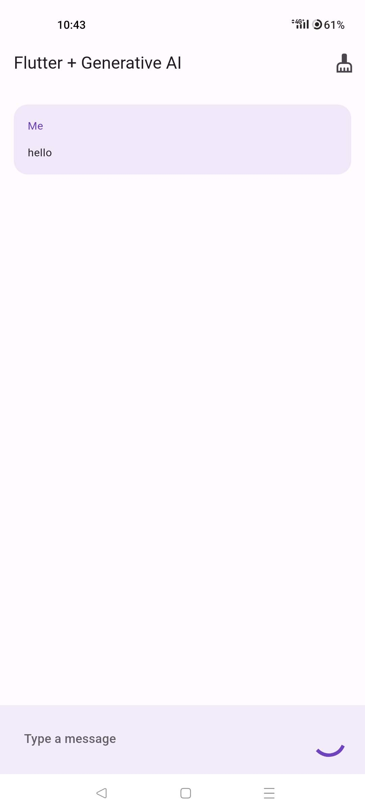
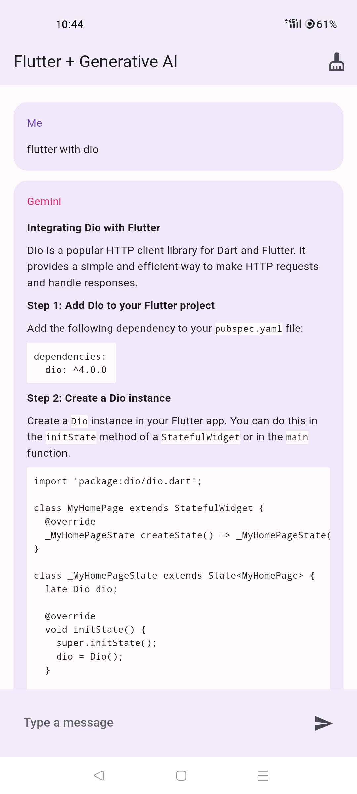

<!-- heading -->
# gemini_bot

<!-- Blockquote -->
<!-- Strong -->
>  This Is A Simple _Gemini Bot_ Flutter Application.

#### Implementing Bloc with Dio.

<!------------
-->

## 👉  Some ScreenShorts

### 👉  Android ScreenShorts

  
  

 

### 👉  iOS ScreenShorts

  
  
  
  

 
